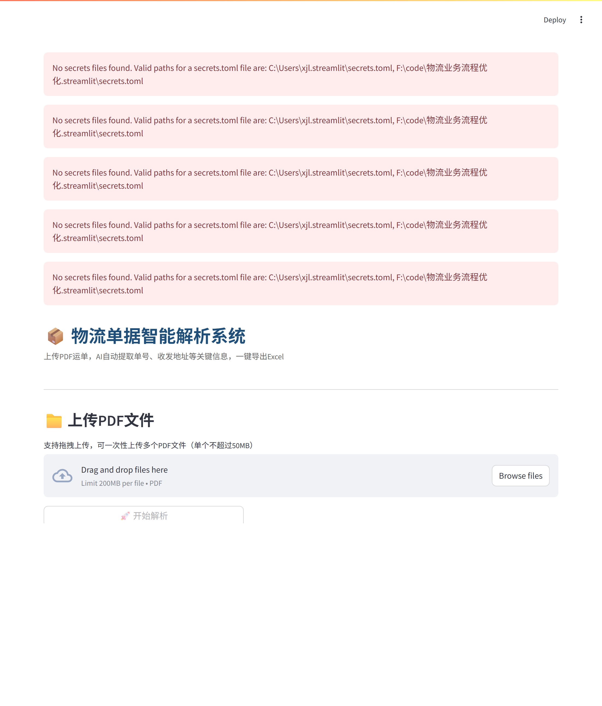
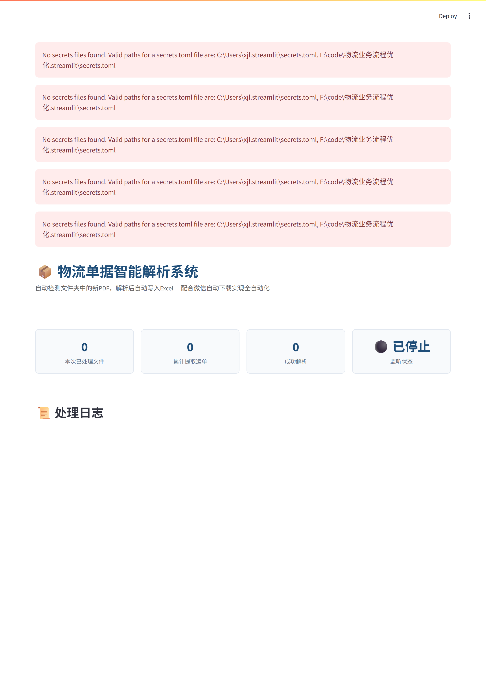
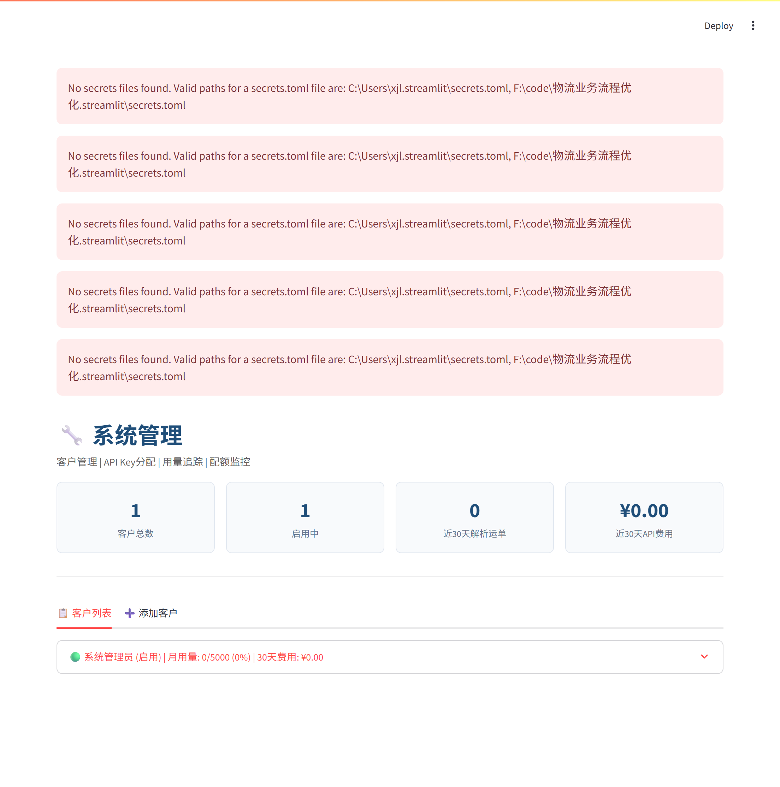

# 📦 物流单据智能解析系统

> 基于 **DeepSeek AI** 的物流运单 PDF 智能解析系统。上传运单 PDF，自动提取运单号、收发件人、电话、地址等关键信息，一键导出 Excel。支持多客户管理、用量追踪、文件夹监听全自动处理。

<p align="left">
  
  
  
  
  
</p>

---

## ✨ 核心功能

### 🧠 智能双引擎解析
- **AI 优先解析**：调用 DeepSeek 大模型，智能提取运单号、收发件人、电话、地址、日期、重量等字段
- **正则兜底**：AI 不可用 / 失败时自动回退正则解析，保证系统高可用
- **三种解析模式**：`AI 优先（推荐）` / `仅 AI` / `仅正则`，自由切换，便于对比评测

### 👥 多客户管理（多租户）
- 每个客户独立分配 API Key，数据与用量互相隔离
- 用量追踪 + 月度配额管理，配额进度条实时提醒
- 按 API 用量自动估算成本，30 天费用一目了然

### 📁 文件夹监听（全自动化）
- 监听微信「文件自动下载」目录
- 收到新 PDF → **自动解析 → 自动追加写入 Excel**
- 全程无需手动操作，适合快递网点 / 仓库等大批量场景

### 📊 结果在线编辑 + 导出
- 解析结果表格可直接在网页上编辑修正（含置信度进度条）
- 一键导出 **Excel / CSV**，字段规范、可直接入库

---

## 🖼️ 界面预览

### 运单解析（手动上传）


### AI 解析结果（可在线编辑）


### 文件夹监听（自动处理）


### 系统管理 · 多客户管理


---

## 🏗️ 技术架构

### 技术栈

| 层级 | 技术选型 | 说明 |
|------|----------|------|
| 前端 | **Streamlit** | 纯 Python 快速构建 Web 界面 |
| AI 解析 | **DeepSeek API** | 兼容 OpenAI 接口，成本低、效果好 |
| PDF 提取 | **pdfplumber + PyMuPDF** | 双库互补，兼容文字版/扫描版 |
| 数据存储 | **SQLite** | 零部署、零依赖的本地数据库 |
| 数据处理 | **Pandas + openpyxl** | 结果结构化与 Excel 导出 |
| 文件监听 | **watchdog** | 监听目录变化，触发自动解析 |

### 解析流程

```
 PDF 上传 / 文件夹监听
        │
        ▼
 文本提取（PyMuPDF / pdfplumber）
        │
        ▼
 AI 解析（DeepSeek）──失败──▶ 正则兜底解析
        │                        │
        ▼                        ▼
  结构化结果（Pydantic 数据模型）
        │
        ▼
 在线编辑 ──▶ 导出 Excel / CSV
```

### 项目结构

```
├── app.py                  # Streamlit 主界面（运单解析 + 系统管理）
├── run.py                  # 桌面启动器（exe 打包用）
├── requirements.txt        # Python 依赖
├── src/
│   ├── ai_parser.py        # DeepSeek AI 解析模块
│   ├── regex_parser.py     # 正则兜底解析
│   ├── pdf_extractor.py    # PDF 文本提取
│   ├── models.py           # Pydantic 数据模型
│   ├── excel_exporter.py   # Excel 导出
│   ├── customer_manager.py # 多客户管理 + 用量追踪
│   ├── folder_watcher.py   # 文件夹监听
│   └── evaluator.py        # AI 效果测评
├── data/                   # 运行时数据（不提交）
├── output/                 # 导出文件（不提交）
├── screenshots/            # 界面截图
└── sample_pdfs/            # 测试用运单 PDF
```

---

## 🚀 快速开始

### 1. 安装依赖

```bash
pip install -r requirements.txt
```

### 2. 配置 API Key

```bash
cp .env.example .env
# 编辑 .env，填入你的 DeepSeek API Key
```

`.env` 内容示例：

```env
DEEPSEEK_API_KEY=sk-你的key
DEEPSEEK_BASE_URL=https://api.deepseek.com
MODEL_NAME=deepseek-chat
```

> 不配置 API Key 也能运行，系统会自动使用**纯正则解析模式**（适合先体验）。

### 3. 启动

```bash
streamlit run app.py
```

浏览器自动打开 http://localhost:8501

---

## 🔑 默认账号

| 角色 | 密码 |
|------|------|
| 管理员 | `admin123` |

登录后在「系统管理」中修改密码。

---

## ☁️ 部署到 Streamlit Cloud（免费）

1. 将本项目推送到 GitHub 仓库
2. 访问 [streamlit.io/cloud](https://streamlit.io/cloud) → New app → 选择仓库
3. Main file path 填 `app.py`
4. Advanced settings → Secrets 中填入：

```toml
DEEPSEEK_API_KEY = "sk-你的key"
```

5. 点击 Deploy，1-2 分钟即可上线，得到一个可分享的网址

---

## 📈 技术亮点（面试重点）

1. **高可用设计**：AI 解析失败自动回退正则，保证核心功能不中断
2. **多租户架构**：客户 API Key 独立分配、用量隔离、配额管理、成本统计
3. **自动化流程**：文件夹监听 + 微信自动下载，实现「零操作」批量处理
4. **结构化数据模型**：Pydantic 定义运单字段，类型安全、易于扩展
5. **可评测性**：内置 AI 效果测评模块，支持 Precision / Recall / F1 对比
